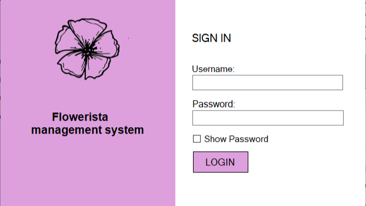
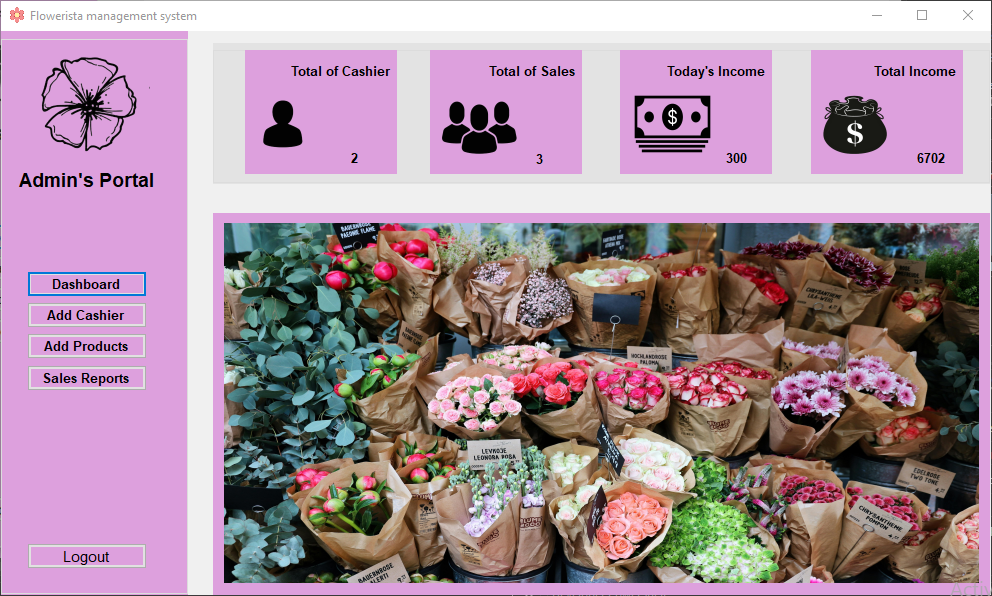
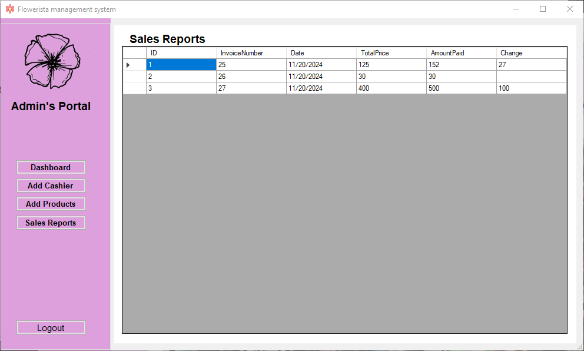
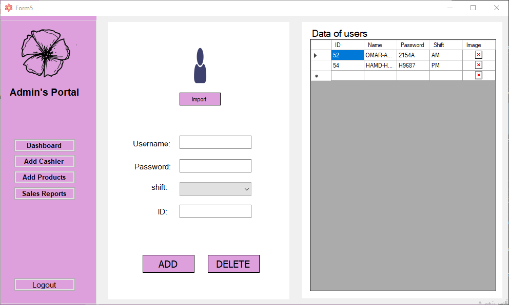
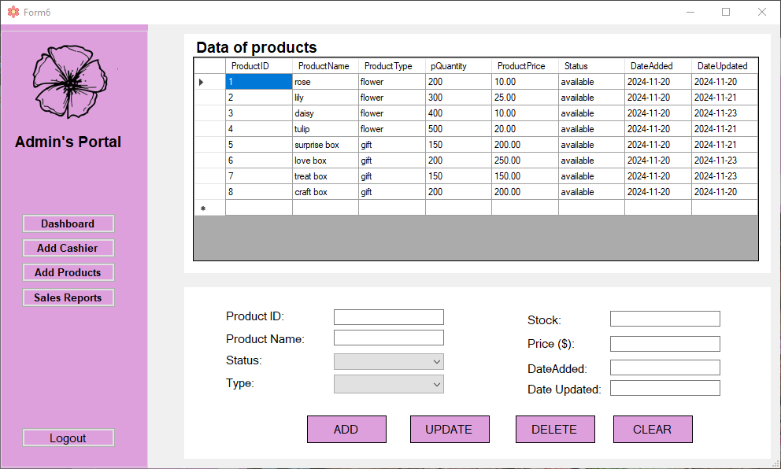
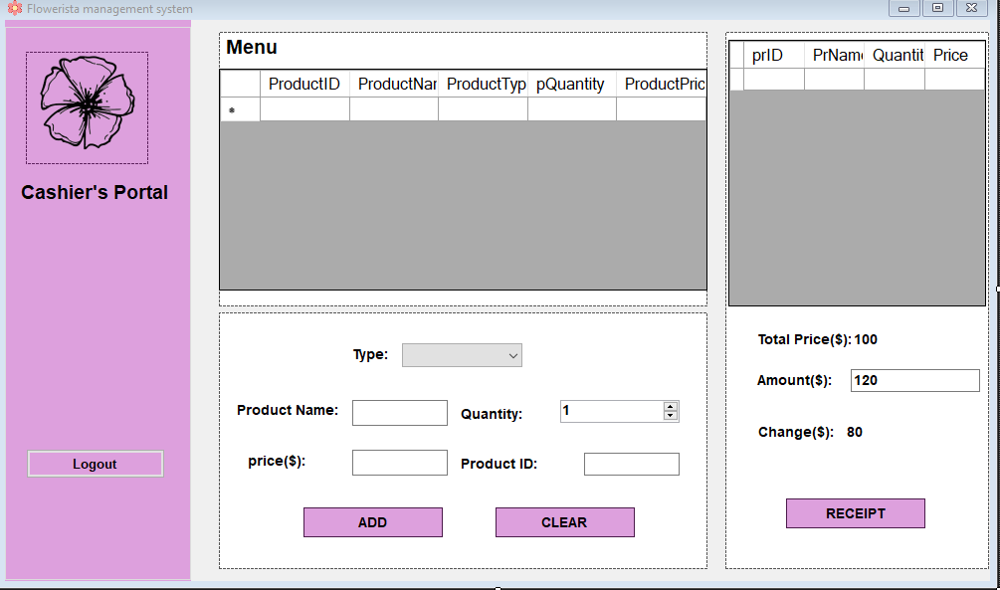

# 🌸 WinFormsStoreManager

> Desktop Store Management System built with C# & Windows Forms

---

## 🎯 Project Overview

**WinFormsStoreManager** is a desktop application developed to manage a flower and gift store operations efficiently.

This project was built during my early university journey while learning desktop application development. Although it reflects an early stage of my programming experience, it demonstrates my structured thinking, logical organization, and ability to design clean multi-form desktop applications.

The system simulates a real-world store management workflow including authentication, product management, cashier management, and sales tracking.

---

## 👩🏻‍💻 My Role & Contribution

As a co-developer of this project, I focused on building the system in a structured and organized way. My contributions included:

* Designing and organizing the overall form structure
* Structuring navigation between forms clearly
* Implementing CRUD operations for products and cashiers
* Connecting the application to the database using Entity Framework
* Designing clean and user-friendly interfaces
* Managing data display using `DataGridView`
* Keeping code readable and logically separated

I aimed to write maintainable and organized code even while still learning desktop development fundamentals.

---

## 🧩 Core Features

* Secure login system (basic authentication)
* Dashboard with sales overview
* POS / Order management system
* Add, edit, and delete products
* Add, edit, and delete cashiers
* Sales reporting module
* Data displayed in tabular format using `DataGridView`
* Multi-form structured navigation

---

## 🏗 Project Structure (Main Forms)

The application is divided into dedicated forms, each responsible for a specific functionality:

| Form       | Responsibility         |
| ---------- | ---------------------- |
| `Form1.cs` | Dashboard              |
| `Form2.cs` | Sales Reports          |
| `Form3.cs` | Login                  |
| `Form4.cs` | POS / Order Management |
| `Form5.cs` | Cashier Management     |
| `Form6.cs` | Product Management     |

This separation improves clarity, maintainability, and scalability.

---

## 🛠 Technology Stack

* C#
* Windows Forms (.NET Framework)
* Entity Framework
* SQL Server / LocalDB
* DataGridView (for tabular data presentation)

---

## 🖼 Screenshots

| Login                           | Dashboard                               | Sales Reports                                  |
| ------------------------------- | --------------------------------------- | ---------------------------------------------- |
|  |  |  |

| Add Cashier                                 | Add Products                                  | Cashier's Portal                                      |
| ------------------------------------------- | --------------------------------------------- | ----------------------------------------------------- |
|  |  |  |

---

## 🚀 Setup & Installation

1. Clone the repository:

```bash
git clone https://github.com/RzanBash/WinFormsStoreManager.git
```

2. Open the solution in Visual Studio
3. Restore NuGet packages (if prompted)
4. Build the solution
5. Run the project

---

## 📚 Learning Reflection

This project represents a foundational step in my development journey.

While some parts of the code (such as hard-coded values) were written for learning purposes, the project demonstrates:

* Understanding of desktop application architecture
* Database integration fundamentals
* CRUD operations implementation
* Multi-form navigation design
* Structured UI organization

It reflects how I approach projects with order, clarity, and logical structuring — even at early learning stages.

---

## 📌 Notes

* Developed as part of a university course in desktop/mobile application development
* Recommended `.gitignore` exclusions:

```
bin/
obj/
*.user
.vs/
*.mdf
*.ldf
```

* Ensure the `screenshots` folder is included for proper README image display

---
